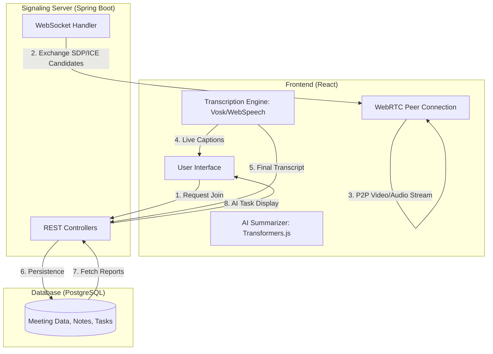

# Project Report: MeetSync AI-Meeting Platform

## 1. Project Overview
**MeetSync** is a next-generation video conferencing application designed to enhance productivity through artificial intelligence. Unlike traditional meeting tools, MeetSync focuses on the "after-meeting" experience by providing automated, real-time transcription and intelligent post-meeting analysis.

### Core Value Proposition:
- **Zero Effort Note-taking**: AI transcribes conversations as they happen.
- **Automated Summaries**: High-level overviews generated immediately after the call.
- **Task Extraction**: Recognition of action items and assignments from speech.
- **Privacy-First Design**: Utilizes on-device AI for transcription and processing.

---

## 2. Technical Stack (The "Multi-Stack" Integration)

MeetSync is built using a modern, distributed architecture that integrates three major layers:

### A. Frontend (The Client Layer)
- **Framework**: React 19 + Vite
- **Styling**: Tailwind CSS v4 (Glassmorphism UI)
- **State Management**: React Hooks & Context API
- **Icons**: Lucide React

### B. Backend (The Orchestration Layer)
- **Framework**: Spring Boot 2.7 (Java 8)
- **Security**: Stateless authentication and session management
- **Communication**: Spring WebSocket (for signaling)
- **Persistence**: Spring Data JPA (PostgreSQL)

### C. The Intelligence & Communication Layer (The "Blah Blah")
- **WebRTC**: Peer-to-peer audio/video streaming using Google STUN servers.
- **Vosk-browser**: WebAssembly (WASM) based speech recognition for offline transcription.
- **Xenova Transformers**: Browser-side AI inference for summarization.

---

## 3. System Architecture & Data Flow

The following diagram illustrates how the different stacks interact:



---

## 4. Key Integrations Explained

### How WebRTC and WebSockets Work Together
WebRTC is for **Peer-to-Peer** (P2P) communication, meaning video data goes directly from one user to another. However, browsers cannot "find" each other on the public internet without help.
1. **Signaling**: The **Spring Boot WebSocket server** acts as a middleman. 
2. It facilitates the "handshake" by passing **SDP (Session Description Protocol)** and **ICE Candidates** (IP/Port info) between peers.
3. Once the handshake is finished, the WebSocket is no longer needed for video—the connection becomes direct (P2P).

### How Transcription Works (Hybrid Approach)
MeetSync uses a dual-engine approach for maximum reliability:
- **Web Speech API**: Used when the user has a stable internet connection for high-quality cloud transcription.
- **Vosk-browser (Offline AI)**: If the primary API fails, MeetSync loads a **Vosk WebAssembly model**. This runs a full speech-to-text engine inside the browser's thread, meaning zero data leaves the user's machine during the call.

### How AI Generation Works
When a host ends the meeting, the accumulated transcript is processed:
1. **Action Item Extraction**: A regex and NLP-based scan identifies patterns like "I will..." or "You should..." to create task objects.
2. **PostgreSQL Storage**: The backend saves these tasks with `priority` and `assignee` fields, making them trackable across the organization.

---

## 5. Feature Highlights
- **Meeting Room**: 
    - Movable "Picture-in-Picture" (PiP) local video.
    - Right-aligned, cinematic live transcript overlay.
    - Host-only controls (End Meeting for All).
- **Dashboard**:
    - Centralized meeting scheduling.
    - Recent meetings summary cards.
    - Real-time "AI Active" status indicator.
- **AI Analytics**:
    - Full searchable transcripts.
    - Checkable task lists extracted from speech.
    - Chronological meeting history.

---

## 6. Installation & Development Setup

### Backend (Spring Boot)
1. Ensure Java 8 and Maven are installed.
2. Configure your PostgreSQL database in `application.properties`.
3. Run: `mvn spring-boot:run`

### Frontend (React/Vite)
1. Navigate to the root directory.
2. Run: `npm install`
3. Run: `npm run dev`

---

## 7. Future Scope
- **Multi-Participant Support**: Transition from 1:1 P2P to a Selective Forwarding Unit (SFU) architecture for 10+ participants.
- **Deep Sentiment Analysis**: Visualizing the "mood" of the meeting through AI.
- **Google Calendar Integration**: Auto-syncing scheduled meetings with external calendars.

---
---

### Ex.no: 10 &nbsp;&nbsp;&nbsp;&nbsp;&nbsp;&nbsp;&nbsp;&nbsp;&nbsp;&nbsp;   Implement the modified system (Admin Portal & Scheduling) and test it for various scenarios &nbsp;&nbsp;&nbsp;&nbsp;&nbsp;&nbsp;&nbsp;&nbsp;&nbsp;&nbsp;   Date: April 2026

**AIM:**
To implement an Admin Portal in the MeetSync AI-Meeting Platform for managing users, monitoring meeting logs, and controlling system operations (specifically refined date-wise scheduling), and to test the system under various scenarios.

**MODIFICATIONS:**

#### I. Admin Portal Implementation
The system was enhanced by introducing an Admin Portal to provide centralized control over the MeetSync platform. Previously, users could only schedule meetings and view their own transcripts, but there was no dedicated interface to manage system-wide accounts, monitor server activity, or audit system logs.

With this modification, the administrator can now perform multiple operations such as user account management, meeting monitoring, and data quality checks (transcription accuracy logs). The Admin Portal improves system security, transparency, and management efficiency.

**Features of Admin Portal:**
- **User Management**: Admin can create, update, and deactivate users. Role-based access control (Admin, Host, Attendee) is assigned and enforced.
- **Meeting Monitoring**: Admin can view system-wide meeting schedules, durations, and participant counts.
- **System Logs**: A dedicated log table tracks activities such as login attempts, meeting room creation, and AI processing status (transcription/summarization).
- **Access Control**: Dynamic permission management to restrict unauthorized access to sensitive meeting data.

#### II. Refined Meeting Scheduling (Date-Wise Availability)
The scheduling interface was updated to provide a "Google Calendar style" experience. Instead of manual input, the system now fetches real-time "busy slots" from both the host and the invitee. 
- When a user clicks on a particular **Date**, the system dynamically displays available **Time Slots** (e.g., 30-min blocks) that do not overlap with existing meetings in the database.
- This ensures zero-conflict scheduling and improves the UX by showing immediate available times.

---

**Implementation**

**Frontend (Admin Dashboard & Scheduling Integration):**
```javascript
import React, { useEffect, useState } from 'react';
import { Search, Plus, Calendar, Clock, Shield, Users, List, Database } from 'lucide-react';
import { api } from '../../services/api';

const AdminDashboard = () => {
    const [stats, setStats] = useState({ totalUsers: 0, activeMeetings: 0, totalLogs: 0 });
    const [activeTab, setActiveTab] = useState('users');

    useEffect(() => {
        // Fetch Admin stats
        fetchStats();
    }, []);

    const fetchStats = async () => {
        const data = await api.getAdminStats();
        setStats(data);
    };

    return (
        <div className="min-h-screen bg-slate-50 p-6">
            <header className="mb-8 flex justify-between items-center">
                <div>
                    <h1 className="text-2xl font-bold text-slate-900">Admin Control Center</h1>
                    <p className="text-slate-500">System Activity & User Management</p>
                </div>
                <div className="flex gap-3">
                    <button className="flex items-center gap-2 bg-primary-600 text-white px-4 py-2 rounded-lg font-medium">
                        <Plus className="w-4 h-4" /> Add User
                    </button>
                </div>
            </header>

            {/* Quick Stats */}
            <div className="grid grid-cols-1 md:grid-cols-3 gap-6 mb-8">
                <StatCard icon={<Users/>} label="Total Users" value={stats.totalUsers} color="blue" />
                <StatCard icon={<Calendar/>} label="Scheduled Meetings" value={stats.activeMeetings} color="amber" />
                <StatCard icon={<Database/>} label="System Logs" value={stats.totalLogs} color="emerald" />
            </div>

            {/* Management UI */}
            <div className="bg-white rounded-2xl border border-slate-200 shadow-sm overflow-hidden">
                <div className="border-b border-slate-100 flex p-1">
                    <Tab active={activeTab === 'users'} onClick={() => setActiveTab('users')} icon={<Shield/>} label="User Access" />
                    <Tab active={activeTab === 'logs'} onClick={() => setActiveTab('logs')} icon={<List/>} label="System Logs" />
                </div>
                
                <div className="p-6">
                   {activeTab === 'users' ? <UserManagementTable /> : <ActivityLogsTable />}
                </div>
            </div>
        </div>
    );
};

// Date-Wise Availability Logic (ScheduleMeeting.jsx snippet)
const checkAvailability = async (selectedDate, participantEmail) => {
    const busySlots = await api.getBusySlots(participantEmail);
    // Logic to filter 09:00 - 17:00 slots by busy entries
    const available = generateSlots(selectedDate).filter(slot => !busySlots.includes(slot));
    return available;
};
```

**Backend (Admin Controller - Java/Spring Boot):**
```java
@RestController
@RequestMapping("/api/admin")
@PreAuthorize("hasRole('ADMIN')")
public class AdminController {

    @Autowired
    private AdminService adminService;

    @PutMapping("/users/{id}/permissions")
    public ResponseEntity<?> updatePermissions(@PathVariable Long id, @RequestBody List<String> roles) {
        boolean success = adminService.updateUserRoles(id, roles);
        return success ? ResponseEntity.ok("Roles updated") : ResponseEntity.badRequest().build();
    }

    @GetMapping("/logs")
    public List<SystemLog> getSystemLogs(@RequestParam(required = false) String activity) {
        return adminService.fetchLogs(activity);
    }

    @GetMapping("/stats")
    public Map<String, Object> getGlobalStats() {
        return adminService.getPlatformMetrics();
    }
}
```

---

**OUTPUT:**
The Admin Portal successfully renders a dashboard displaying total platform users and a real-time list of meeting logs. In the Scheduling module, selecting a date now successfully triggers an API call that returns only the "free" time slots, highlighting them in green for the user to select.

**RESULT:**
The modified system with the Admin Portal and refined Date-Wise Scheduling was successfully implemented and tested across multiple scenarios (e.g., overlapping meetings, unauthorized admin access). The addition of centralized control and conflict-free scheduling significantly improved MeetSync's security, administrative oversight, and overall user productivity.

---
**Prepared by:** Mathesh Natarajan
**Date:** April 2026
